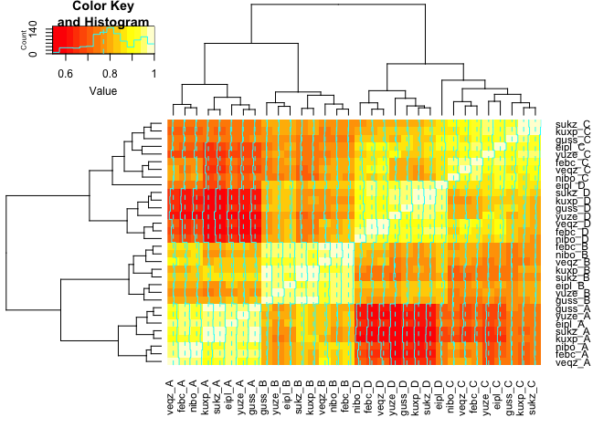
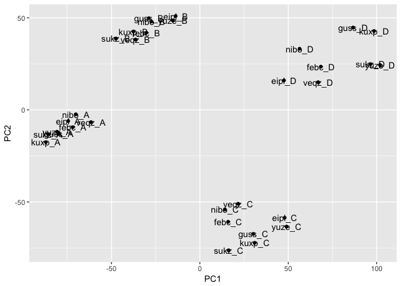
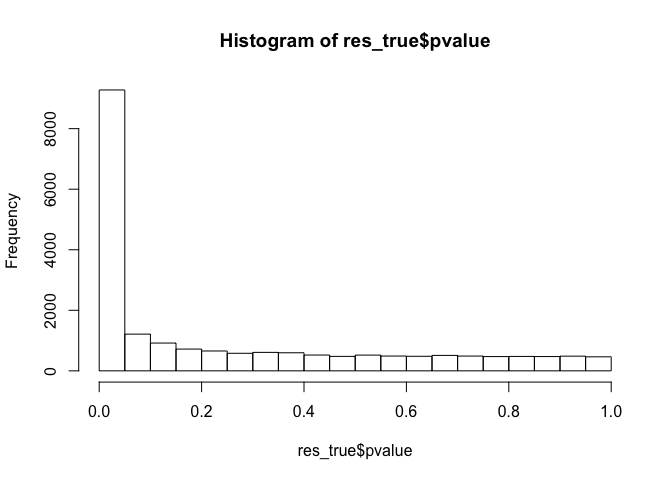
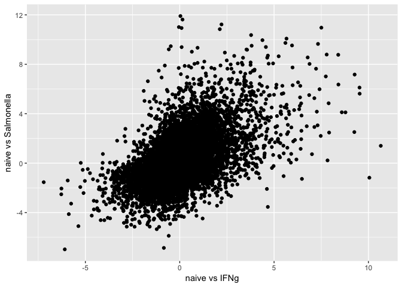

# Exploring gene expression data


First, we need to load the libraries:


```r
library("SummarizedExperiment")
library("DESeq2")
library("dplyr")
library("gplots")
library("ggplot2")
```

## Importing the data

First, you can import the data into R using to following command:


```r
	dataset = readRDS("../data/RNA_SummarizedExperiment.rds")
```


Here, `dataset` is an [SummarizedExperiment](https://bioconductor.org/packages/release/bioc/vignettes/SummarizedExperiment/inst/doc/SummarizedExperiment.html)  object. The key advantage of using SummarizedExperiment class is that the gene expression read count matrix is always stored together with the accompanying gene and sample metadata. Consequently, when you subset the data, SummarizedExperiment ensures that the metadata is always synchronised with the expression data itself. For more information, have a look at the [SummarizedExperiment](https://bioconductor.org/packages/release/bioc/vignettes/SummarizedExperiment/inst/doc/SummarizedExperiment.html) tutorial.

You can see the summary of the dataset by just printing it out:

```r
	dataset
```

```
## class: SummarizedExperiment 
## dim: 35033 336 
## metadata(0):
## assays(1): counts
## rownames(35033): ENSG00000198888 ENSG00000198763 ...
##   ENSG00000233136 ENSG00000165795
## rowData names(11): gene_id gene_biotype ... exon_starts exon_ends
## colnames(336): aipt_A aipt_B ... zuta_C zuta_D
## colData names(44): sample_id donor ... mean_purity_filtered
##   purity_bins
```
The `## dim` line tells to that this dataset has 35033 genes and 336 samples. 

You can view the sample metadata (first 5 rows and columns) using the `colData()` function:

```r
	colData(dataset)[1:5,1:5]
```

```
## DataFrame with 5 rows and 5 columns
##          sample_id       donor   condition replicate condition_name
##        <character> <character> <character> <integer>    <character>
## aipt_A      aipt_A        aipt           A         1          naive
## aipt_B      aipt_B        aipt           B         1           IFNg
## aipt_C      aipt_C        aipt           C         1         SL1344
## aipt_D      aipt_D        aipt           D         1    IFNg_SL1344
## auim_A      auim_A        auim           A         1          naive
```
And you can do the same for gene metadata:

```r
	rowData(dataset)[1:5,]
```

```
## DataFrame with 5 rows and 11 columns
##           gene_id   gene_biotype         chr gene_strand gene_start
##       <character>    <character> <character>   <integer>  <integer>
## 1 ENSG00000198888 protein_coding          MT           1       3307
## 2 ENSG00000198763 protein_coding          MT           1       4470
## 3 ENSG00000198804 protein_coding          MT           1       5904
## 4 ENSG00000198712 protein_coding          MT           1       7586
## 5 ENSG00000228253 protein_coding          MT           1       8366
##    gene_end percentage_gc_content   gene_name    length exon_starts
##   <integer>             <numeric> <character> <integer> <character>
## 1      4262                 47.70      MT-ND1       956        3307
## 2      5511                 42.99      MT-ND2      1042        4470
## 3      7445                 46.24      MT-CO1      1542        5904
## 4      8269                 46.20      MT-CO2       684        7586
## 5      8572                 39.61     MT-ATP8       207        8366
##     exon_ends
##   <character>
## 1        4262
## 2        5511
## 3        7445
## 4        8269
## 5        8572
```

Finally, to view the raw read counts, you can use the assays command:

```r
	assays(dataset)
```

```
## List of length 1
## names(1): counts
```


```r
	assays(dataset)$counts[1:5,1:5]
```

```
##                 aipt_A aipt_B aipt_C aipt_D auim_A
## ENSG00000198888  71321  43991  65274  92505  78993
## ENSG00000198763  83356  37810  66529  81534  62912
## ENSG00000198804 434520 232305 411873 545619 219557
## ENSG00000198712 172090  72174 150233 168686  93480
## ENSG00000228253  20189  11908  20965  24346  17239
```

# Subsetting
To illustrate the power of SummarizedExperiment, let's take random subset of the data containing eight random donors. First, let's identify the donors:

```r
	set.seed(1)
  donors_subset = colData(dataset)$donor %>% unique() %>% sample(8)
  donors_subset
```

```
## [1] "febc" "guss" "kuxp" "veqz" "eipl" "sukz" "yuze" "nibo"
```
Note that I used the `%>%` (pipe) operator from the dplyr pacakge. The last command is exactly equivalent (but more readable) as the following:

```r
	set.seed(1)
  donors_subset = sample(unique(colData(dataset)$donor),8)
  donors_subset
```

```
## [1] "febc" "guss" "kuxp" "veqz" "eipl" "sukz" "yuze" "nibo"
```

Now we can just subset the original dataset:

```r
data_subset = dataset[,dataset$donor %in% donors_subset]
data_subset
```

```
## class: SummarizedExperiment 
## dim: 35033 32 
## metadata(0):
## assays(1): counts
## rownames(35033): ENSG00000198888 ENSG00000198763 ...
##   ENSG00000233136 ENSG00000165795
## rowData names(11): gene_id gene_biotype ... exon_starts exon_ends
## colnames(32): eipl_A eipl_B ... yuze_C yuze_D
## colData names(44): sample_id donor ... mean_purity_filtered
##   purity_bins
```
Note the that we now have 8 donors x 4 conditions = 32 samples.

# Expolratory data analysis
First, let's convert the SummarizedExperiment object into a DESeq object:

```r
dds <- DESeqDataSet(data_subset, design = ~ condition_name)
```

```
## Warning in DESeqDataSet(data_subset, design = ~condition_name): some
## variables in design formula are characters, converting to factors
```

```r
dds
```

```
## class: DESeqDataSet 
## dim: 35033 32 
## metadata(1): version
## assays(1): counts
## rownames(35033): ENSG00000198888 ENSG00000198763 ...
##   ENSG00000233136 ENSG00000165795
## rowData names(11): gene_id gene_biotype ... exon_starts exon_ends
## colnames(32): eipl_A eipl_B ... yuze_C yuze_D
## colData names(44): sample_id donor ... mean_purity_filtered
##   purity_bins
```

Next, let's perform variance stabilising normalisation:

```r
vsd <- vst(dds, blind=FALSE)
```
This is what the data looks like after normalisation:

```r
  assay(vsd)[1:5, 1:5]
```

```
##                   eipl_A   eipl_B   eipl_C   eipl_D   febc_C
## ENSG00000198888 16.00214 16.07723 16.90692 16.84831 15.73874
## ENSG00000198763 15.78570 15.89761 16.70480 16.58796 15.61369
## ENSG00000198804 18.07762 18.18235 19.24408 18.93902 18.01835
## ENSG00000198712 16.61340 16.76516 17.68664 17.44199 16.55762
## ENSG00000228253 13.90250 13.94963 14.89475 14.78564 13.90849
```
Now, let's etract 10,000 most highly expressed genes

```r
  highly_expressed = names(sort(rowMeans(assay(vsd)), decreasing = TRUE)[1:10000])
  vsd = vsd[highly_expressed,]
```

The simplest exploratory analysis is to look at the heatmap pairwise sample-to-sample correlations:

```r
cor_matrix = cor(assay(vsd), method = "spearman")
gplots::heatmap.2(cor_matrix)
```

<!-- -->

Second approach is to perform PCA. DESeq2 has a built-in function for that:

```r
  plotPCA(vsd, intgroup=c("condition_name"))
```

<!-- -->
Alternatively, you can do it manually using prcomp and ggplot2. The advantage of the manual approach is that you can customise the plot more, including adding names for individual samples:

```r
  pca = prcomp(t(assay(vsd)), center = TRUE, scale. = TRUE)
  pca_matrix = dplyr::mutate(as.data.frame(pca$x), sample_id = rownames(pca$x))
  ggplot(pca_matrix, aes(x = PC1, y = PC2, label = sample_id)) + geom_text() + geom_point()
```

<!-- -->
## Differential expression

For simplicity let's first look at only two conditions - naive and interferon-gamma stimulation:


```r
naive_IFNg = data_subset[,data_subset$condition_name %in% c("naive", "IFNg")]
```

Make DEseq2 object

```r
dds <- DESeqDataSet(naive_IFNg, design = ~ condition_name)
```

```
## Warning in DESeqDataSet(naive_IFNg, design = ~condition_name): some
## variables in design formula are characters, converting to factors
```

```r
dds$condition_name = relevel(dds$condition_name, ref = "naive")
```

Remove genes that have very low absolute expression levels

```r
keep <- rowSums(counts(dds)) >= 10
dds <- dds[keep,]
```

#Run DEseq2

```r
dds <- DESeq(dds)
```

```
## estimating size factors
```

```
## estimating dispersions
```

```
## gene-wise dispersion estimates
```

```
## mean-dispersion relationship
```

```
## final dispersion estimates
```

```
## fitting model and testing
```

```
## -- replacing outliers and refitting for 106 genes
## -- DESeq argument 'minReplicatesForReplace' = 7 
## -- original counts are preserved in counts(dds)
```

```
## estimating dispersions
```

```
## fitting model and testing
```

```r
res_true <- results(dds)
res_shrunken = lfcShrink(dds, res = res_true, coef = 2)
```

Make a histogram of the p-values

```r
hist(res_true$pvalue)
```

<!-- -->

#Identify genes that are signficantly differentially expressed:

```r
filtered_genes = dplyr::mutate(as.data.frame(res_shrunken), gene_id = rownames(res_shrunken)) %>% 
  dplyr::tbl_df() %>% 
  dplyr::filter(!is.na(padj)) %>% #Remove NA p-values
  dplyr::filter(padj < 0.01) %>% #Filter according to FDR
  dplyr::filter(abs(log2FoldChange) > 1) %>% #Filter according to fold-change
  dplyr::arrange(-log2FoldChange) #Sort by fold change
filtered_genes
```

```
## # A tibble: 3,330 x 6
##       baseMean log2FoldChange     stat        pvalue          padj
##          <dbl>          <dbl>    <dbl>         <dbl>         <dbl>
##  1   8880.1010      10.654123 33.15813 4.323555e-241 9.429674e-238
##  2   2722.6045      10.049970 34.79360 3.039808e-265 8.524056e-262
##  3  20295.7665       9.535093 34.85597 3.457197e-266 1.131022e-262
##  4  37561.9083       9.527324 22.21456 2.484022e-109 1.250227e-106
##  5 154578.4962       9.268288 22.55206 1.281820e-112 7.400246e-110
##  6   1145.9508       9.253149 26.33414 7.798646e-153 6.655636e-150
##  7  16774.9637       8.783483 17.78067  9.978904e-71  1.780690e-68
##  8    779.0683       8.589000 18.43823  6.482583e-76  1.398314e-73
##  9  24491.4834       8.408930 17.16655  4.726983e-66  7.543572e-64
## 10    238.5990       8.399524 13.89131  7.151127e-44  4.908023e-42
## # ... with 3,320 more rows, and 1 more variables: gene_id <chr>
```

Save the results to disk:

```r
write.table(filtered_genes, "../data/naive_vs_IFNg_gene_list.txt", sep = "\t", quote = FALSE, row.names = FALSE)
```


#Now, let's repeat the same analysis for naive vs Salmonella condition


```r
naive_SL1344 = data_subset[,data_subset$condition_name %in% c("naive", "SL1344")]
dds <- DESeqDataSet(naive_SL1344, design = ~ condition_name)
```

```
## Warning in DESeqDataSet(naive_SL1344, design = ~condition_name): some
## variables in design formula are characters, converting to factors
```

```r
dds$condition_name = relevel(dds$condition_name, ref = "naive")

#Keep expressed genes
keep <- rowSums(counts(dds)) >= 10
dds <- dds[keep,]

#Run DEseq2
dds <- DESeq(dds)
```

```
## estimating size factors
```

```
## estimating dispersions
```

```
## gene-wise dispersion estimates
```

```
## mean-dispersion relationship
```

```
## final dispersion estimates
```

```
## fitting model and testing
```

```
## -- replacing outliers and refitting for 117 genes
## -- DESeq argument 'minReplicatesForReplace' = 7 
## -- original counts are preserved in counts(dds)
```

```
## estimating dispersions
```

```
## fitting model and testing
```

```r
res_true <- results(dds)
res_shrunken_SL1344 = lfcShrink(dds, res = res_true, coef = 2)
```


```r
#Now, let compare the log2FoldChanges
lfc_SL1344 = dplyr::mutate(as.data.frame(res_shrunken_SL1344), gene_id = row.names(res_shrunken_SL1344)) %>% dplyr::tbl_df()
lfc_IFNg = dplyr::mutate(as.data.frame(res_shrunken), gene_id = row.names(res_shrunken)) %>% 
  dplyr::tbl_df()
joint_lfc = dplyr::inner_join(lfc_IFNg, lfc_SL1344, by = "gene_id")

ggplot(joint_lfc, aes(x = log2FoldChange.x, y = log2FoldChange.y)) + geom_point() +
  xlab("naive vs IFNg") + 
  ylab("naive vs Salmonella")
```

<!-- -->

```r
cor.test(joint_lfc$log2FoldChange.x, joint_lfc$log2FoldChange.y)
```

```
## 
## 	Pearson's product-moment correlation
## 
## data:  joint_lfc$log2FoldChange.x and joint_lfc$log2FoldChange.y
## t = 83.143, df = 19994, p-value < 2.2e-16
## alternative hypothesis: true correlation is not equal to 0
## 95 percent confidence interval:
##  0.4964970 0.5170971
## sample estimates:
##       cor 
## 0.5068694
```

