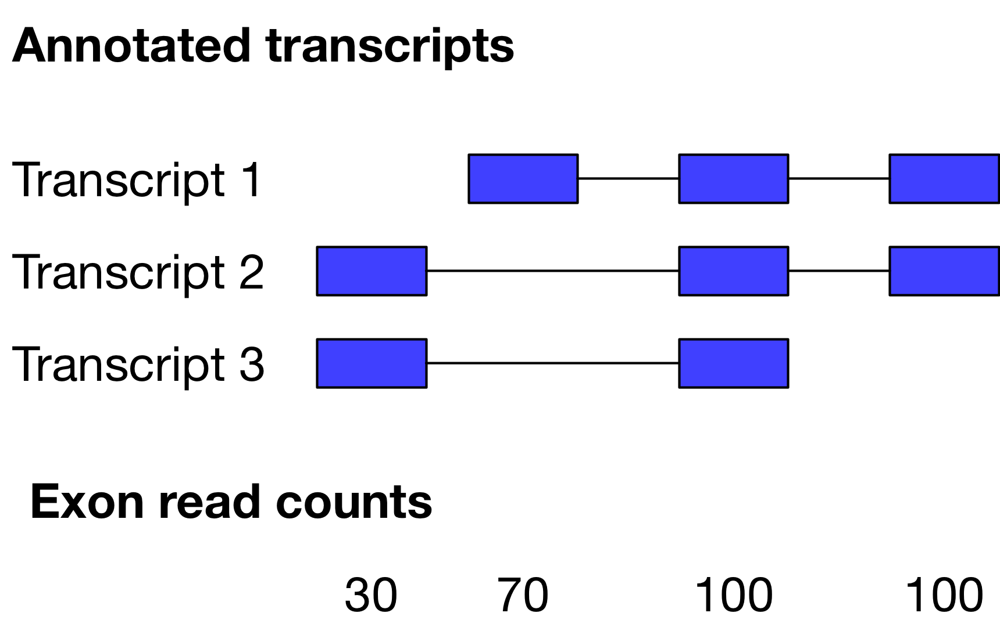

# Homework 3

## Task 1: Estimating transcript expression using the EM algorithm
**Learning objective**: Understand how the EM algorithm can be used to estimate transcript expression and how it can be influenced by missing transcript annotations.

Your are given the following three transcripts with corresponding exon-level read counts. You can assume that all exons have equal length of 100 nucleotides. With the help of the EM algorithm tutorial, answer the following questions:
<!-- -->

 1. Write down the transcript compatibility matrix `M` and the corresponding read count vector `k`. See the example in the slides for reference.
 2. Using the EM-algorithm implemented in the tutorial, estimate the expression of all three transcripts. In our report, provide these final estimates after 1000 iterations as well as a visualisation of how these estimates evolved.
 3. Now, remove Transcript 2 from the annotations, construct a new transcript compatibility matrix `M` and count vector `k` and re-estimate the expression of the remaining two transcripts. How did the expression estimates change compared to using the original 'correct' annotations?

## Task 2: Identify transcripts that are differentially used between conditions
**Learning objective**: Learn how differentially used transcripts can be detected using DRIMSeq and how these changes can be visualized using IGV.

**Dataset:** [SummarizedExperiment object](https://www.dropbox.com/s/hwl30are5g6k3ka/salmon_SummarizedExperiment_subset.rds?dl=0) ([alternative link](https://1drv.ms/f/s!AmCRrTXF10_MgWr91VIHfVT9booG)) containing transcript expression estimated using Salmon. [BigWig files](https://1drv.ms/f/s!AmCRrTXF10_MgWr91VIHfVT9booG) for visualisation.

**Software: **[DRIMSeq R package](http://bioconductor.org/packages/release/bioc/html/DRIMSeq.html), IGV

## Task 3: Visualise differentially used transcripts using IGV

<!--stackedit_data:
eyJoaXN0b3J5IjpbLTI5MjYyMjg4N119
-->