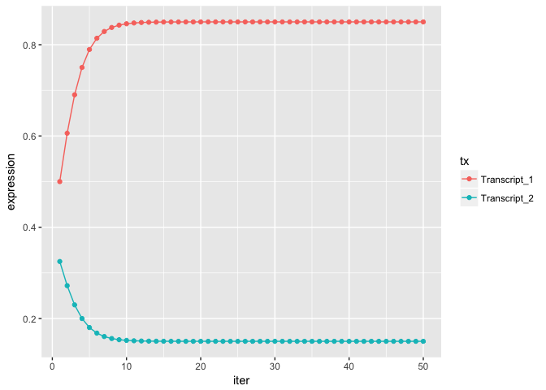

# EM-algorithm


# Estimating transcript expression with the Expectation-Maximisation algorithm

<!-- -->


# The EM-algorihm

```r
library("dplyr")
library("ggplot2")
library("tidyr")
```

First, we need an implementation of the EM-algorithm to estimate transcript abundances from exon-level counts and exon lengths:


```r
performEM <- function(M, k, len, NITER){
  #Original implementation provided by Ernest Turro 
	mu.trace <- list()
	X.trace <- list()

	#Initialize X and mu
	#Divide k reads equally among transcripts
	x <- k/apply(M,1,sum)
	X = c()
	for (i in c(1:ncol(M))){ X = cbind(X,x) }
	X.trace[[1]] <- X * M
	mu.trace[[1]] <- apply(X.trace[[1]],2,sum)/len #Initialize mu with its maximum likelihood estimate

	#Implementation of the EM algorithm
	for (iter in c(2:NITER)){
		mu = mu.trace[[iter-1]] #Take the latest mu values
		X = matrix(NA, ncol = ncol(M), nrow = nrow(M)) #Initalize X with empty matrix

		#The E-step (updated X_it)
		for (i in c(1:nrow(M))){
			for (t in c(1:ncol(M))){
				X[i,t] <- k[i]*M[i,t]/sum(M[i,]*mu)*mu[t]
			}
		}
		X.trace[[iter]] = X
		#The M-step (find maximum likelihood estimate of mu)
		mu.trace[[iter]] = apply(X,2,sum)/len
	}
	results = as.data.frame(do.call(rbind, mu.trace))
	colnames(results) = paste0("Transcript_", 1:ncol(results))
	return(results)
}
```

And another function to plot the progress of the EM algorithm:

```r
plotTraces <- function(mu.em, NITER = 50){
  plot_data = dplyr::mutate(mu.em, iter = c(1:1000)) %>% 
    dplyr::select(iter, everything()) %>%
      tidyr::gather("tx", "expression", -iter)
  plot = ggplot(dplyr::filter(plot_data, iter <= NITER), aes(x = iter, y = expression, group = tx, color = tx)) + 
  geom_point() + 
  geom_line()
  return(plot)
}
```

## Two correctly annotated transcripts (Scenario 1A)
First, let's specify the data. Note that in this example, the `len` parameter contains the lengths of the transcripts as opposed to the the lengths of the invidual equivalence classes that we used in the slides. This is so, because for simplicity, we have decided to ignore any reads that map to exon-exon junctions.

```r
len <- c(200, 300) # Transcript lengths
M <- matrix(c(1,1,0,1), byrow = T, ncol = 2) #the transcripts
k <- c(200,30) # the counts for each set

#Run the EM-algorithm
mu.em = performEM(M,k,len, NITER = 1000)
tail(mu.em,1)
```

```
##      Transcript_1 Transcript_2
## 1000          0.7          0.3
```

We can now visualize the progress of the algorithm:

```r
plotTraces(mu.em)
```

<!-- -->

## Two correctly annotated transcripts + 1 unexpressed transcript (Scenario 1B)


```r
len <- c(200, 300, 400) # the lengths
M <- matrix(c(1,1,1,0,1,1,0,0,1), byrow = T, ncol = 3) #the transcripts
k <- c(200,30,0) # the counts for each set

#Run the EM-algorithm
mu.em = performEM(M,k,len, NITER = 1000)
tail(mu.em,1)
```

```
##      Transcript_1 Transcript_2  Transcript_3
## 1000          0.7          0.3 3.454496e-126
```

And make the plot

```r
plotTraces(mu.em)
```

<!-- -->

## One of the true transcripts is missing, reads are captured by the transcript that is actually not expressed (Scenario 1C)

```r
len <- c(200, 400) # the lengths
M <- matrix(c(1,1,0,1), byrow = T, ncol = 2) #the transcripts
k <- c(200,30) # the counts for each set

#Run the EM-algorithm
mu.em = performEM(M,k,len, NITER = 1000)
tail(mu.em,1)
```

```
##      Transcript_1 Transcript_2
## 1000         0.85         0.15
```

And make the plot

```r
plotTraces(mu.em)
```

<!-- -->
